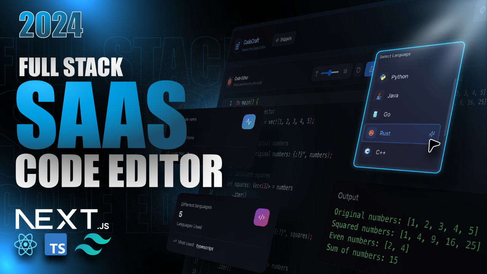

# CodeCraft 🚀

**CodeCraft** is a modern, interactive code editor and execution platform that allows developers to write, run, and share code snippets across multiple programming languages. Built with Next.js and featuring a sleek dark theme with beautiful gradients, CodeCraft provides a seamless coding experience for developers of all levels.



## ✨ Features

### 🖥️ **Interactive Code Editor**
- **Monaco Editor** integration with syntax highlighting
- Support for **10+ programming languages**: JavaScript, TypeScript, Python, Java, C++, Go, Rust, C#, Ruby, Swift, and more
- **Real-time code execution** using Piston API
- **Customizable editor** with theme selection and font size adjustment
- **Keyboard shortcuts** - Run code with `Ctrl+Enter` or `Cmd+Enter`

### 👤 **User Management**
- **Secure authentication** powered by Clerk
- **User profiles** with execution history and stats
- **Snippet management** - Save, organize, and share your code
- **Starred snippets** - Bookmark your favorite code examples

### 💎 **Pro Features**
- **Unlimited private snippets**
- **Access to premium languages** (Pro subscription required for non-JavaScript languages)
- **Enhanced collaboration features**
- **Priority support**
- **Create multi-file projects**

### 🌐 **Modern UI/UX**
- **Beautiful dark theme** with blue/purple gradients
- **Responsive design** - works on desktop, tablet, and mobile
- **Smooth animations** and hover effects
- **Glass-morphism design** elements

## 🛠️ Tech Stack

- **Frontend**: Next.js 14 (App Router), React, TypeScript
- **Styling**: Tailwind CSS, Framer Motion
- **Editor**: Monaco Editor
- **Authentication**: Clerk
- **Backend**: Convex (Real-time database)
- **Code Execution**: Piston API
- **Payments**: LemonSqueezy
- **Deployment**: Vercel

## 🚀 Getting Started

### Prerequisites
- Node.js 18+ 
- npm, yarn, pnpm, or bun

### Installation

1. **Clone the repository**
   ```bash
   git clone https://github.com/yourusername/code-craft.git
   cd code-craft
   ```

2. **Install dependencies**
   ```bash
   npm install
   # or
   yarn install
   # or
   pnpm install
   ```

3. **Set up environment variables**
   
   Create a `.env.local` file in the root directory and add:
   ```env
   # Clerk Authentication
   NEXT_PUBLIC_CLERK_PUBLISHABLE_KEY=your_clerk_publishable_key
   CLERK_SECRET_KEY=your_clerk_secret_key

   # Convex Backend
   NEXT_PUBLIC_CONVEX_URL=your_convex_deployment_url
   CONVEX_DEPLOY_KEY=your_convex_deploy_key

   # LemonSqueezy (for payments)
   LEMONSQUEEZY_WEBHOOK_SECRET=your_webhook_secret
   LEMONSQUEEZY_API_KEY=your_api_key
   ```

4. **Set up Convex**
   ```bash
   npx convex dev
   ```

5. **Run the development server**
   ```bash
   npm run dev
   # or
   yarn dev
   # or
   pnpm dev
   ```

6. **Open your browser**
   
   Navigate to [http://localhost:3000](http://localhost:3000) to see CodeCraft in action!

## 📁 Project Structure

```
code-craft/
├── src/
│   ├── app/                    # Next.js app router pages
│   │   ├── (root)/            # Main editor interface
│   │   ├── pricing/           # Pricing and Pro features
│   │   ├── profile/           # User profile and history
│   │   ├── snippets/          # Code snippet management
│   │   ├── support/           # Support center
│   │   ├── privacy/           # Privacy policy
│   │   └── terms/             # Terms of service
│   ├── components/            # Reusable UI components
│   ├── store/                 # Zustand state management
│   ├── hooks/                 # Custom React hooks
│   └── types/                 # TypeScript type definitions
├── convex/                    # Convex backend functions
├── public/                    # Static assets
└── README.md
```

## 🎯 Key Features Explained

### Code Execution
CodeCraft uses the Piston API to securely execute code in isolated containers. Supported languages include:
- **JavaScript** (Free)
- **TypeScript** (Pro)
- **Python** (Pro)
- **Java** (Pro)
- **C++** (Pro)
- **Go** (Pro)
- **Rust** (Pro)
- **And more...**

### Snippet Sharing
- Create and share code snippets with the community
- Public snippets are discoverable by all users
- Private snippets (Pro feature) for personal use
- Comment and collaborate on shared code

### Real-time Database
Convex provides real-time synchronization for:
- User authentication state
- Code execution history
- Snippet management
- User profiles and statistics

## 🤝 Contributing

We welcome contributions! Please feel free to submit a Pull Request. For major changes, please open an issue first to discuss what you would like to change.

## 📝 License

This project is licensed under the MIT License - see the [LICENSE](LICENSE) file for details.

## 🙏 Acknowledgments

- [Monaco Editor](https://microsoft.github.io/monaco-editor/) - The code editor that powers VS Code
- [Piston API](https://piston.readthedocs.io/) - Code execution engine
- [Clerk](https://clerk.dev/) - Authentication and user management
- [Convex](https://convex.dev/) - Real-time backend platform
- [Tailwind CSS](https://tailwindcss.com/) - Utility-first CSS framework

## 📧 Support

Need help? Visit our [Support Center](/support) or reach out:
- **Email**: support@codecraft.dev
- **Community**: [GitHub Discussions](https://github.com/codecraft/discussions)

---

**Built for developers, by developers** 🧑‍💻

*CodeCraft - Where code meets craft* ✨
